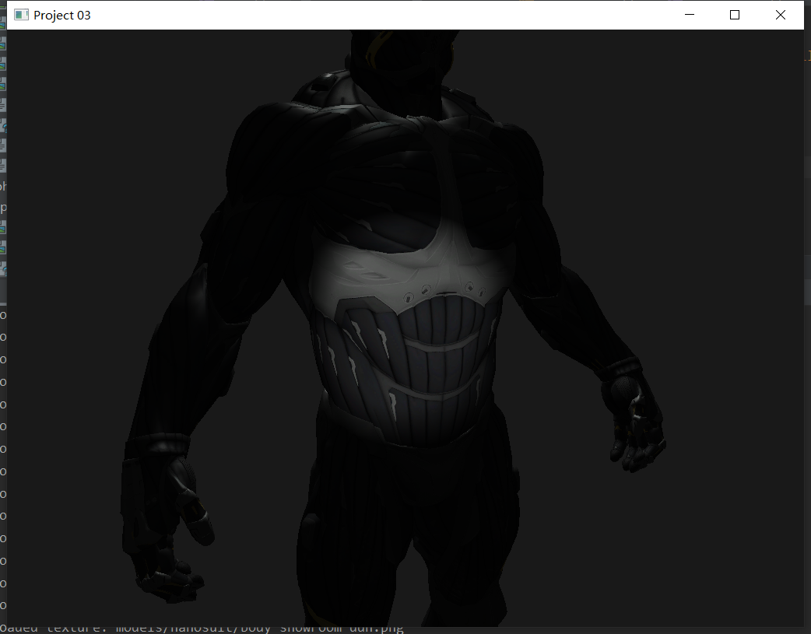
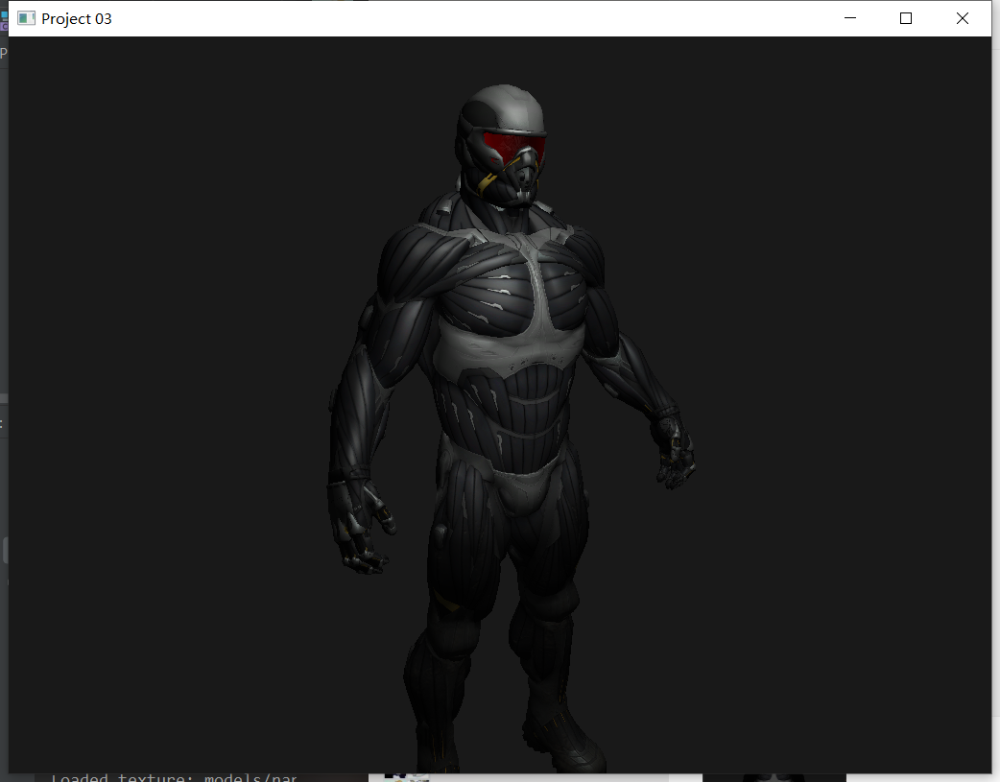

# 编程作业3：复杂三维模型显示

### 1. 要求

- 支持以下三维模型文件格式中至少1种：
  
  - OBJ
  - 3DS
  - STL
- 支持多个光源的光照效果，使用着色器渲染
- 支持多种视点浏览方式  
  - 以模型为中心的平移旋转和缩放
  - 以视点为中心的场景漫游

### 2. 我的环境

- win10 + clion
- OpenGL 3.3
- 库文件：glfw + glad + glm + stbi_image + assimp3.3 

### 3. 完成情况

- 完成OBJ文件解析
- 完成多个光源：点光源、聚光灯
- 完成视点浏览：视点为中心的场景漫游

### 4. 成果展示

