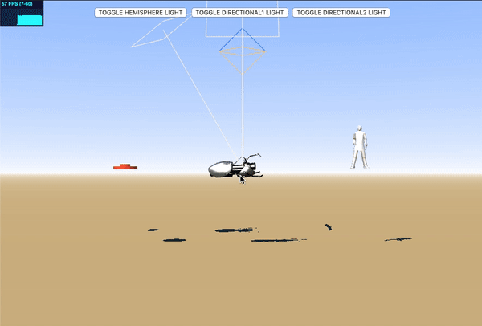

# Implementation

- OBJ, 3DS and STL are supported (Project03-1.html)
- Support lighting effects from multiple sources, using shaders for rendering (Project03-1.html)
- Support model-centered translation, rotation and scaling (Project03-1.html)
- Support viewpoint-centered scene roaming, also known as "First-Person Shooter" (Project03-2.html)

# Usage

Start by running a server in the Project03 directory

`python -m http.server`

Then enter the corresponding url in the browser

There are two HTML files in src that you can open to see the effect

# Results

## Project03-1

## Project03-2

This work is inspired by Minecraft :satisfied:

