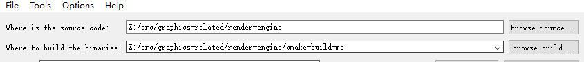
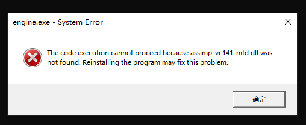
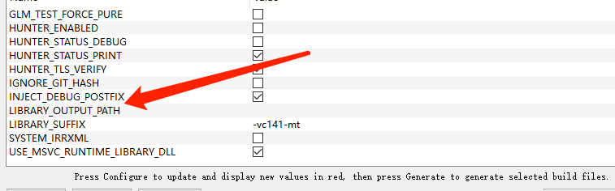
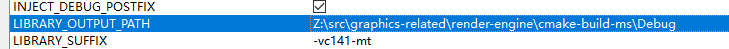
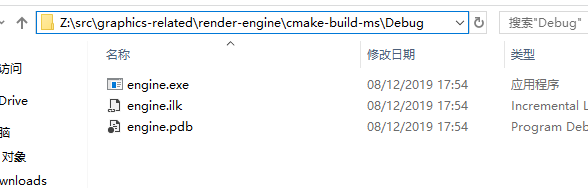
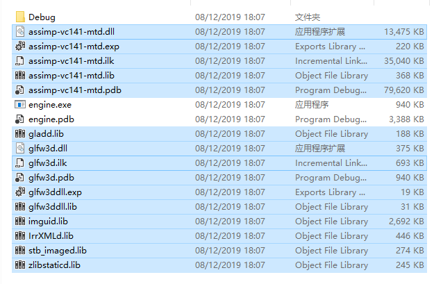
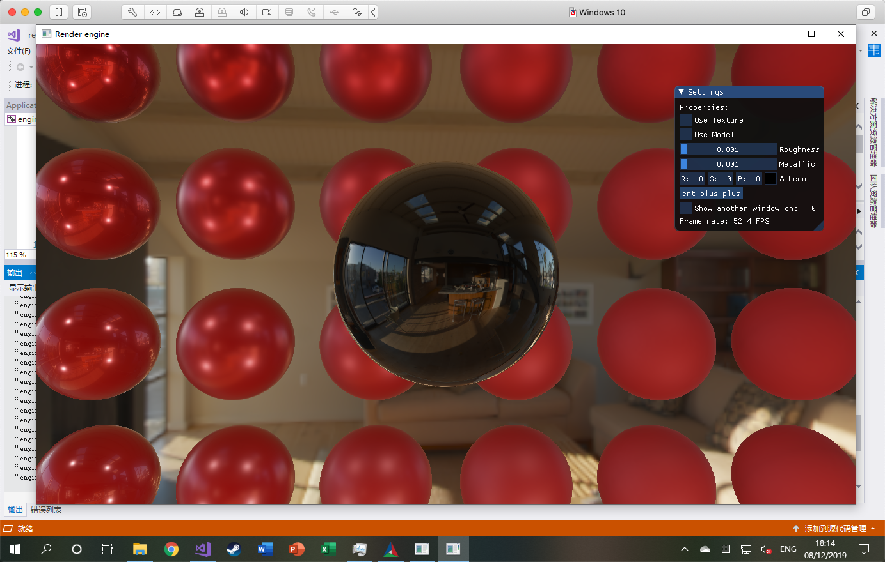

# How to build under M$ Visual Studio

需要：

1. Visual Studio 2017 (or later)
2. Cmake 3.14+ (GUI)

步骤:

1. 在根目录下创建 cmake-build-ms 文件夹（或者你随便叫什么别的名字都行），然后分别选项目根目录，和根目录下你新创建的那个文件夹：

2. 点一下Configure，选你的VS版本，点Finish，再点一下Configure，再点Generate
3. 如果没有问题，点Open Project，应该就可以看到你们最喜欢的VS了
4. 在左边“解决方案管理器”，选择`engine`作为启动项
5. build一遍，如果没有出现意外，你会看到

6. 不要惊慌，这只是因为VS build的runtime并不会自动在目录下寻找dll文件（也是因为我cmakelists写的太垃圾了）。详见：https://cmake.org/pipermail/cmake/2012-June/050960.html

7. 为了解决这个问题，重新打开我们可爱的Cmake-gui，找到`LIBRARY_OUTPUT_PATH`这一项

    

8. 把它设成VS所生成的包含exe目录，比如在我的虚拟机里，是：

9. 再点一下 Configure，再点一下 Generate，然后 OpenProject，再build一遍

10. 虽然这次你依然会看到和第5步一样的错误，但是打开你之前设为`LIBRARY_OUTPUT_PATH`那个目录，你会看到多了一个Debug文件，这个文件里包含了我们需要的所有编译好的依赖库。把它们拖出来放到和.exe相同的目录下；或者在vs里设置相关的library path（这里图省事选了前者）：

    

11. 不出意外，再点一下运行你就可以跑了

    

P.S.：目前这只是非常肮脏的一种解决办法，中期等我的cmake技术提升了以后，应该会有更好的解决方案

P.P.S：如果直接用Windows下的Clion，大概率可以省去这一堆破事

P.P.P.S：如果你之前在learn opengl的过程中已经有了assimp、glm、stb_image、glfw、glad这些相关的依赖库，你也可以直接自己再配置一个imgui（implementation记得选glfw + glad），然后在你原本的环境上跑