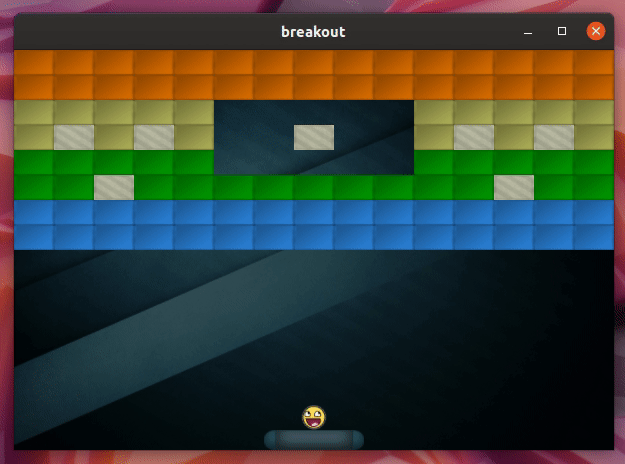

# 2D-Breakout
## 三维动画与交互技术大作业：打砖块小游戏

## 作业环境：

- Ubuntu 19.10
- OpenGL 4.5
- Qt 5.14

## 参考教程：

[LearnOpenGL](https://learnopengl.com/In-Practice/2D-Game/Breakout)

## 完成情况：

- 游戏框架搭建

- 精灵的渲染
- 物体碰撞
- 游戏画面渲染

## 最终效果：

