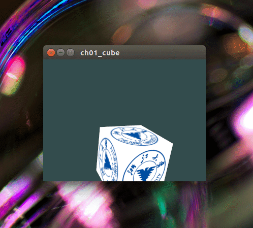
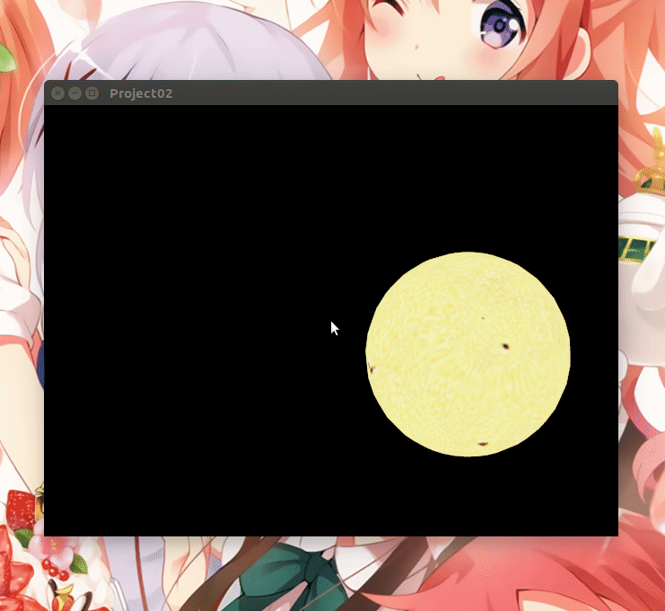

# 编程作业1：OpenGL基本程序

## 要求：

+ 使用glfw和glew搭建OpenGL基本框架
  + 也可以使用glut或者Qt等其他框架

+ 实现基本模型绘制
  + 绘制立方体、球体或者茶壶
+ 实现相机控制
  + 支持从不同视角和距离观察模型

## 我的作业环境：

+ Ubuntu 16.04 
+ OpenGL 3.3
+ Qt 5.13

## Qt中的OpenGL配置

参考《Game Programming using Qt 5 Beginner's Guide - Second Edition》第9章

参考的配置代码：[Chapter09/OpenGL and Vulkan in Qt applications/2. scene](https://github.com/PacktPublishing/Game-Programming-Using-Qt-5-Beginners-Guide-Second-Edition/tree/master/Chapter09/OpenGL%20and%20Vulkan%20in%20Qt%20applications/2.%20scene) 

## 作业1完成情况：

+ 结合Qt搭建了OpenGL的基本框架
+ 实现了立方体的绘制
+ 实现了相机控制

作业1参考教程：[LearnOpenGL](https://learnopengl-cn.github.io/01%20Getting%20started/09%20Camera/)

### 作业成果：

# 编程作业2：绘制太阳系（只含太阳、月亮、地球）动画

## 要求：

### 必选特性：

1. 光照
   + 太阳为光源
2. 纹理
   + 使用图片进行纹理映射

### 可选特性：

3. 使用顶点着色器和片段着色器
   + 自己实现光照效果
4. 鼠标选择
   + 点击不同的球体显示不同名称

## 我的作业环境：

- Ubuntu 16.04 
- OpenGL 3.3
- Qt 5.13
- ASSIMP 5.0

## 参考教程：

### 模型贴图

1. [blender给球体贴图](https://en.m.wikibooks.org/wiki/Blender_3D:_Noob_to_Pro/UV_Map_Basics)

### 模型载入：

1. [Qt和OpenGL：使用Open Asset Import Library（ASSIMP）加载3D模型](https://blog.csdn.net/u010750137/article/details/103547324)
2. [Qt和OpenGL：使用Open Asset Import Library（ASSIMP）加载3D模型-第2部分](https://blog.csdn.net/u010750137/article/details/103547387)
3. [LearnOpenGL：模型](https://learnopengl-cn.github.io/03%20Model%20Loading/03%20Model/)

### 鼠标物体拾取：

1. [OpenGL3.3鼠标拾取物体](https://blog.csdn.net/u010750137/article/details/103534731)

### 光照设置：

1. [多光源](https://learnopengl-cn.github.io/02%20Lighting/06%20Multiple%20lights/)

## 作业2完成情况：

+ 实现了利用ASSIMP库加载模型及纹理贴图
+ 使用着色器实现了Phong光照模型，太阳为光源
+ 实现了为太阳、地球、月球贴图
+ 实现了自转和公转
+ 使用着色器实现了拾取功能，实现了点击球体改变球体的光照达到高亮显示的效果

