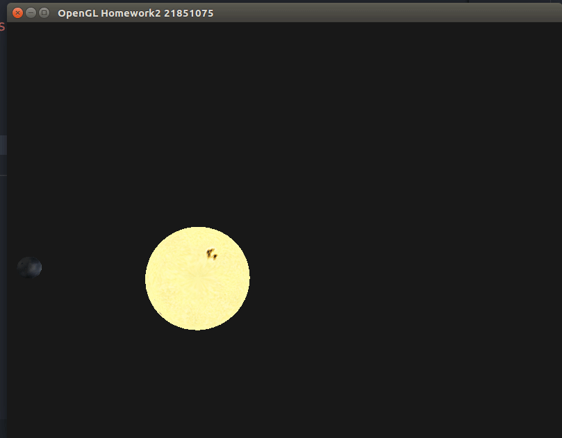
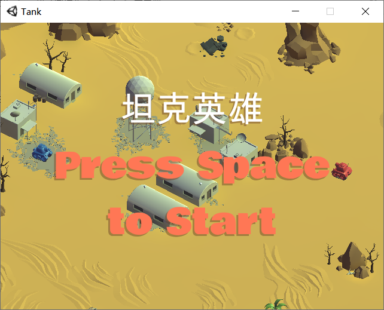
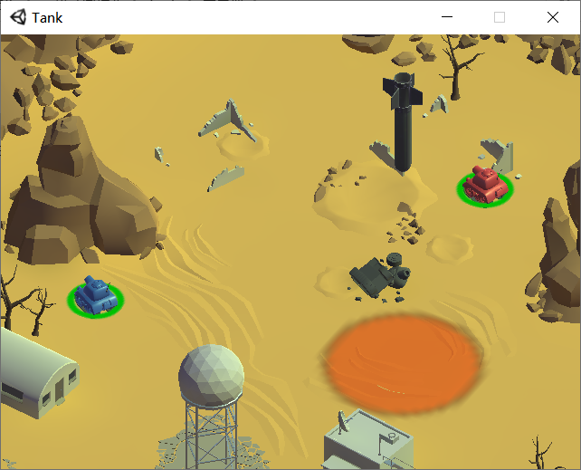

# 孙松涛

## 作业一: 
- 显示茶壶，可进行旋转移动缩放等

## 作业2：
- 显示太阳系中的太阳，地球和月球。
- 自定义shader
 

## 作业3：
- 显示模型
- 使用光照
- 视角转换

**视频位置:`/project3/run_sample.mp4`**

## 课程大作业
- 双人坦克大战
- Unity3D制作
- 玩家1使用wasd移动，空格发射炮弹
- 玩家2使用上下左右方向键移动，Enter发射炮弹
- 地图中会有导弹，被砸到会受到伤害
- 地图中会出现补给，拾取后恢复血量
**pic1**

**pic2**

## 读书报告
