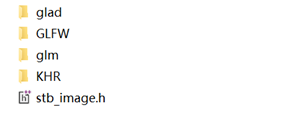
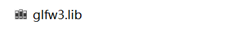

## 作业要求： ##
1.	用glfw和glew搭建OpenGL基本框架（也可以使用glut或者Qt等其他框架）
2.	实现基本模型绘制，绘制立方体、球体或者茶壶
3.	实现相机控制，支持从不同视角和距离观察模型

## 作业步骤： ##
### 	搭建OpenGL的基本框架 ###
1. 选择使用glfw和glad来搭建OpenGL基本框架，glfw使用预编译的源代码包在本机上编译编译之后获得glfw3.lib文件，添加到/lib文件夹中。并把GLFW库链接到工程。
2. 然后配置GLAD，他是一个开源库，使用在线配置，并将配置好的文件下载添加到库文件当中。
同时也要导入glm和一个用于读取图片文件的stb_image.h头文件
最终有Include文件夹如下：

有Libs文件夹如下：

 

### 绘制基本模型 ###
绘制一个简单的立方体，具体实现见main.cpp文件.
### 实现相机控制 ###
通过相机控制要实现对观测物体在不同角度和距离去查看，通过添加一个camera的类来进行控制，camera类放在head/camera.h当中。
## 作业结果： ##
使最终展示结果如下：

 

